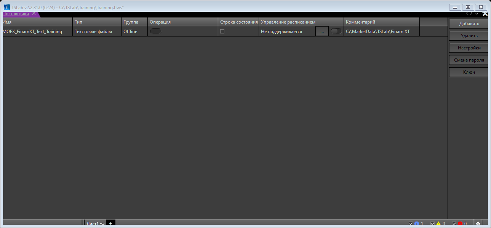

# TSLab 2.2 — продуктивная работа (практический канон)

## 1) Проверенный baseline (на 2026-02-25)

По официальным источникам:
- Актуальный релиз в линейке 2.2: **TSLab 2.2.31.0**.
- Платформа: **.NET 8**.
- Минимальная ОС: **Windows 10 x64**.

Важно: перед каждым циклом обновления сверяй версию на официальной странице загрузки.

## 2) Безопасный режим старта (чтобы не сделать реальную сделку)

1. Первый запуск делай только в учебном workspace.
2. Не подключай боевого брокера до завершения оффлайн-проверок.
3. Историю сначала прогоняй через оффлайн-поставщика.
4. Любое изменение фиксируй как артефакт: скрин + параметры + отчёт.

## 3) Иллюстрации: реальный интерфейс TSLab

Живой снимок окна поставщиков из текущей среды:



Исторические иллюстрации из базы знаний AlgoTrading (учебные шаги):


## 4) Пошаговый запуск за 15–20 минут

### Шаг A. Установка и запуск

1. Скачай TSLab только с официальной страницы загрузки.
2. Установи и запусти приложение.
3. Создай отдельное учебное пространство (например, `Training`).

### Шаг B. Добавление оффлайн-поставщика

1. Открой окно поставщиков данных (`Данные -> Поставщики`).
2. Нажми `Добавить`.
3. Выбери `Текстовые файлы`.
4. Задай имя (например, `MOEX_FinamXT_Text_Training`).
5. Заполни параметры папки/формата и сохрани.

### Шаг C. Подготовка истории (CSV)

Для оффлайн CSV в документации TSLab зафиксированы требования:
- время в UTC,
- разделитель полей `;`,
- дробная часть через `.`,
- без заголовка,
- чтение до первой пустой строки.

Практический экспорт в TSLab-совместимый CSV из MOEX ISS:

```powershell
python tslab_offline_csv.py moex --secid SBER --from 2024-01-01 --till 2024-01-10 --interval 24 --out .tmp\SBER_D1.csv
```

### Шаг D. Открытие графика

1. Открой график.
2. В свойствах выбери созданного оффлайн-поставщика.
3. Выбери инструмент и таймфрейм.
4. Убедись, что свечи действительно загружены.

### Шаг E. Первый скрипт

Минимальная структура:
- источник баров/таймфрейм,
- сигнал входа,
- выход,
- риск-блок (stop/take/ограничения).

### Шаг F. Первый backtest

Проверяй минимум:
- сделки есть и логичны,
- нет аномальной частоты входов,
- результат воспроизводим при повторном прогоне.

## 5) Продуктивный контур (операционно)

## 5.1 Каноничные команды integrator

Проверка здоровья контура:

```powershell
python -m integrator algotrading doctor --json
python -m integrator algotrading config show --json
python -m integrator algotrading config validate --json
```

Синхронизация SSOT в `LocalAI` и создание конфига:

```powershell
python -m integrator algotrading sync-ssot --force --json
python -m integrator algotrading config init --fill-from-vault --force --json
```

Запуск обработки видео-уроков (когда готова входная директория):

```powershell
python -m integrator algotrading run --base "C:\Video" --out "C:\integrator\vault\Projects\AlgoTrading\processed" --limit 0 --json
```

Оптимизация уроков/базы знаний:

```powershell
python -m integrator algotrading optimize-lessons --config "C:\integrator\vault\Projects\AlgoTrading\Configs\algotrading.json" --json
```

## 5.2 Контур проверки стратегии

1. Backtest на оффлайн данных.
2. Разделение train/forward участка.
3. Оптимизация только в разумных диапазонах (min/max/step), без "узких" подгонок.
4. Прогоны устойчивости на соседних периодах.
5. Только после acceptance-критериев — переход к live-профилю.

## 6) Практика из AlgoTrading (привязка к видео)

Используй карточки:
- `vault\Projects\AlgoTrading\Notes\StrategyCards\*.md`

И MOC:
- `vault\Projects\AlgoTrading\Notes\MOC — Strategy Cards (Video) — 2026-02-24.md`

Принцип:
- каждая цитата/таймкод -> либо параметр оптимизации, либо правило входа/выхода, либо операционное правило агента.

## 7) Частые проблемы и быстрые решения

1. Нет свечей на графике:
- проверь путь к CSV,
- проверь формат времени/разделителей,
- проверь выбранного поставщика в свойствах графика.

2. Стратегия "слишком хороша":
- расширь forward-проверку,
- ослабь подгонку диапазонов,
- добавь риск-лимиты.

3. Дрейф путей и скриптов:
- используй `integrator algotrading config` как канон,
- избегай ручных абсолютных путей в заметках/командах.

## 8) Официальные источники

- Загрузка/версии TSLab: https://www.tslab.pro/en/download
- Документация TSLab (главная): https://doc.tslab.pro/
- Окно поставщиков данных: https://doc.tslab.pro/tslab/rabota-s-programmoi/okno-postavshiki-dannykh
- Оффлайн поставщик данных (CSV): https://doc.tslab.pro/tslab/rabota-s-programmoi/postavshiki-dannykh/offline-postavshik-dannykh
- Оптимизация стратегий: https://doc.tslab.pro/tslab/rabota-s-programmoi/optimizaciya-strategii

